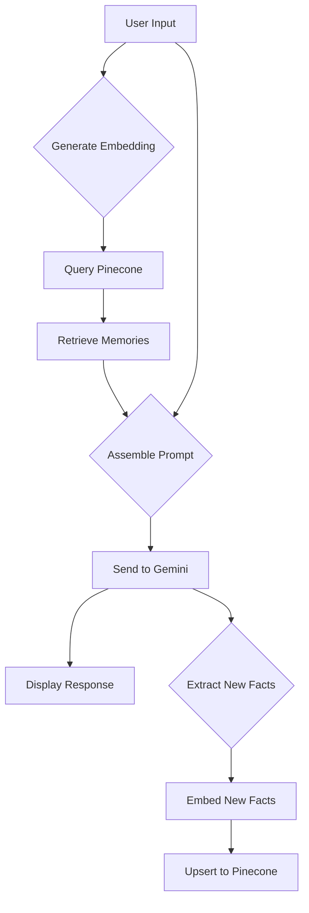

# Vector Memory

Vector Memory is a terminal-based AI assistant that uses Google's Gemini for conversational intelligence and Pinecone for persistent, quarriable long-term memory.

## Features

-   **Natural Conversation**: Engage in natural, human-like conversations.
-   **Persistent Memory**: Remembers key facts from conversations.
-   **Context-Aware Responses**: Retrieves relevant memories to provide contextually-aware, personalized responses.
-   **Continuous Learning**: Continuously learns and appends new memories over time.

## How It Works

The application follows a request/response/memory cycle:

1.  **User Input**: The user enters a message.
2.  **Memory Retrieval**: The application generates a vector embedding of the user's input and queries the Pinecone index to find the most similar memories.
3.  **Context Assembly**: A new prompt is constructed for the chat model, including a system prompt, the retrieved memories, and the user's current message.
4.  **LLM Interaction**: The assembled prompt is sent to the Gemini model.
5.  **Response Generation**: The application receives and displays the generated response.
6.  **Memory Extraction & Storage**: The conversation turn is sent to Gemini in a separate call to extract new, permanent facts. These facts are then embedded and upserted into the Pinecone index.



## Technologies Used

-   **Language**: Python
-   **LLM**: Google Gemini
-   **Vector Database**: Pinecone
-   **Libraries**:
    -   `google-generativeai`
    -   `pinecone-client`
    -   `python-dotenv`
    -   `rich`

## Setup and Installation

1.  **Clone the repository**:
    ```bash
    git clone https://github.com/your-username/vector-memory.git
    cd vector-memory
    ```

2.  **Create a virtual environment**:
    ```bash
    python -m venv .venv
    source .venv/bin/activate  # On Windows, use `.venv\Scripts\activate`
    ```

3.  **Install the required packages**:
    ```bash
    pip install -r requirements.txt
    ```

4.  **Create a `.env` file** in the root of the project and add your API keys:
    ```
    GEMINI_API_KEY="YOUR_GEMINI_API_KEY"
    PINECONE_API_KEY="YOUR_PINECONE_API_KEY"
    ```

## Usage

To run the application, execute the following command:

```bash
python vector_memory.py
```

## Customization

-   **System Prompt**: You can customize the AI's personality and behavior by modifying the `SYSTEM_PROMPT` variable in `vector_memory.py`.
-   **Initial Data**: You can add your own initial facts to the `INITIAL_FACTS` list in `vector_memory.py` to give the AI some starting knowledge.
